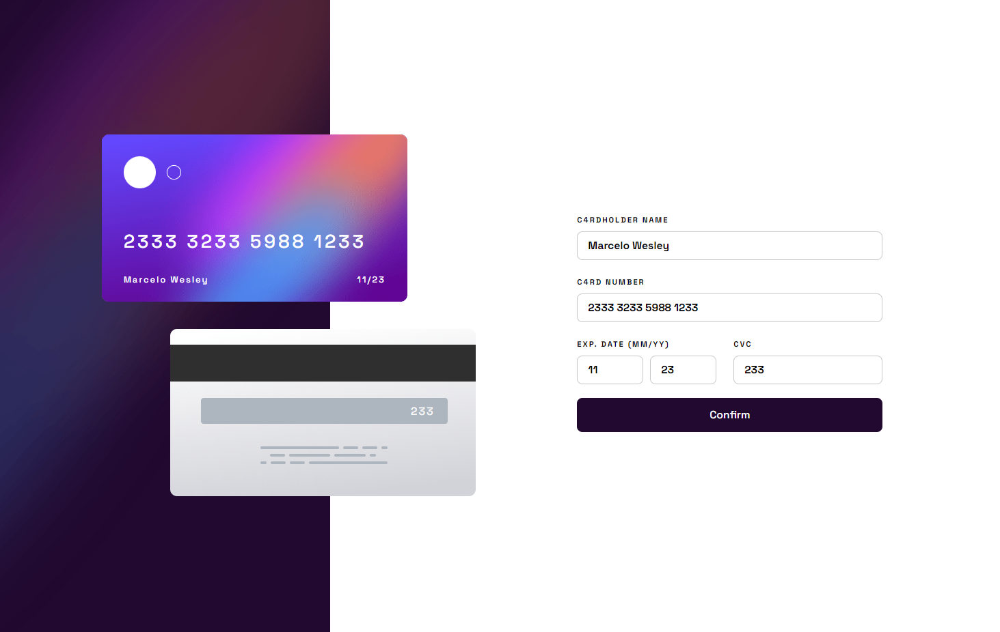
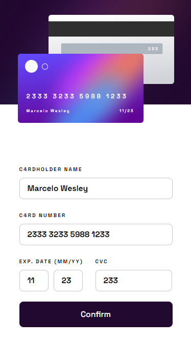

# Frontend Mentor - Interactive card details form solution

This is a solution to the [Interactive card details form challenge on Frontend Mentor](https://www.frontendmentor.io/challenges/interactive-card-details-form-XpS8cKZDWw). Frontend Mentor challenges help you improve your coding skills by building realistic projects. 

## Table of contents

- [Overview](#overview)
  - [The challenge](#the-challenge)
  - [Screenshot Desktop](#screenshot-desktop)
  - [Screenshot Mobile](#screenshot-mobile)
  - [Links](#links)
- [My process](#my-process)
  - [Built with](#built-with)
  - [What I learned](#what-i-learned)
  - [Continued development](#continued-development)
- [Author](#author)

**Note: Delete this note and update the table of contents based on what sections you keep.**

## Overview

### The challenge

Users should be able to:

- Fill in the form and see the card details update in real-time
- Receive error messages when the form is submitted if:
  - Any input field is empty
  - The card number, expiry date, or CVC fields are in the wrong format
- View the optimal layout depending on their device's screen size
- See hover, active, and focus states for interactive elements on the page

### Screenshot Desktop



 <h3>Screenshot Mobile</h3>



### Links

- Solution URL: [Add solution URL here](https://your-solution-url.com)
- Live Site URL: [Add live site URL here](https://your-live-site-url.com)

## My process

### Built with

- Semantic HTML5 markup
- CSS custom properties
- Media queries
- Flexbox
- TypeScript
- Angular
- Angular Reactive forms
- Rxjs

### What I learned

I developed myself mainly in terms of transferring data from one component to another through Angular's Behavior Subject.

```js
//on service class
private name$ = new BehaviorSubject<any>({});
selectedName$ = this.name$.asObservable();

setName(name: any) {
	this.name$.next(name);
}

//set value from any component
async setCardFormName(input: string):Promise<void> {
	this.cardFormService.setName(input);
}

//on another component, subscribe at the method from service class to get the value
this.cardFormService.selectedName$.subscribe((value) => {
	this.selectedName = value;
});

```

### Continued development

I would like to delve deeper into web design for mobile devices, and create more and more responsive applications, on projects where I could use component-based frameworks.

## Author

- Website - [Marcelo Wesley](https://www.your-site.com)
- Frontend Mentor - [@wesleylcarraway](https://www.frontendmentor.io/profile/yourusername)
